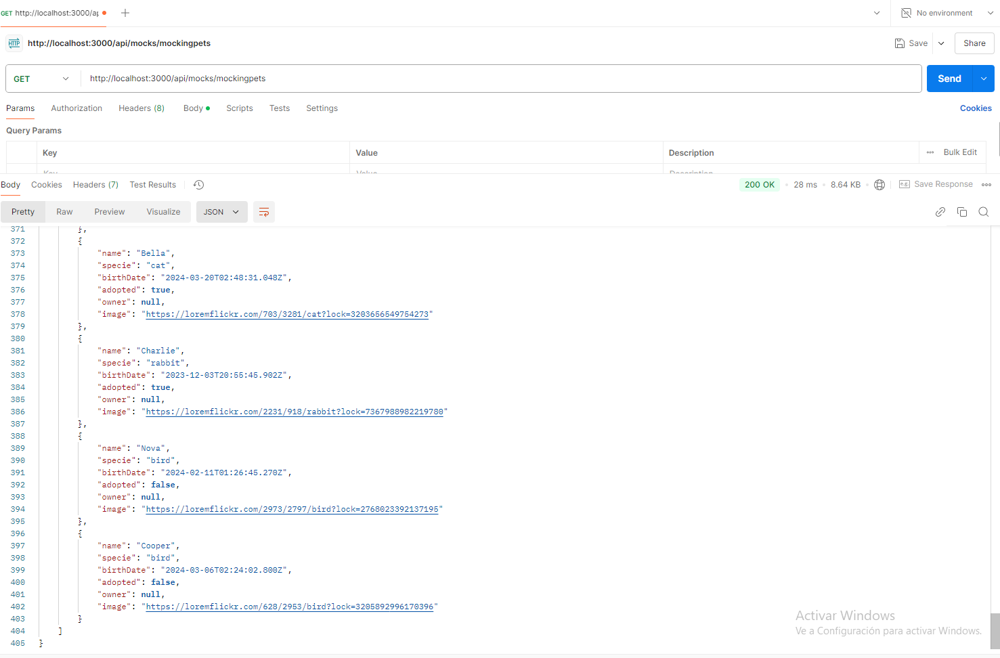
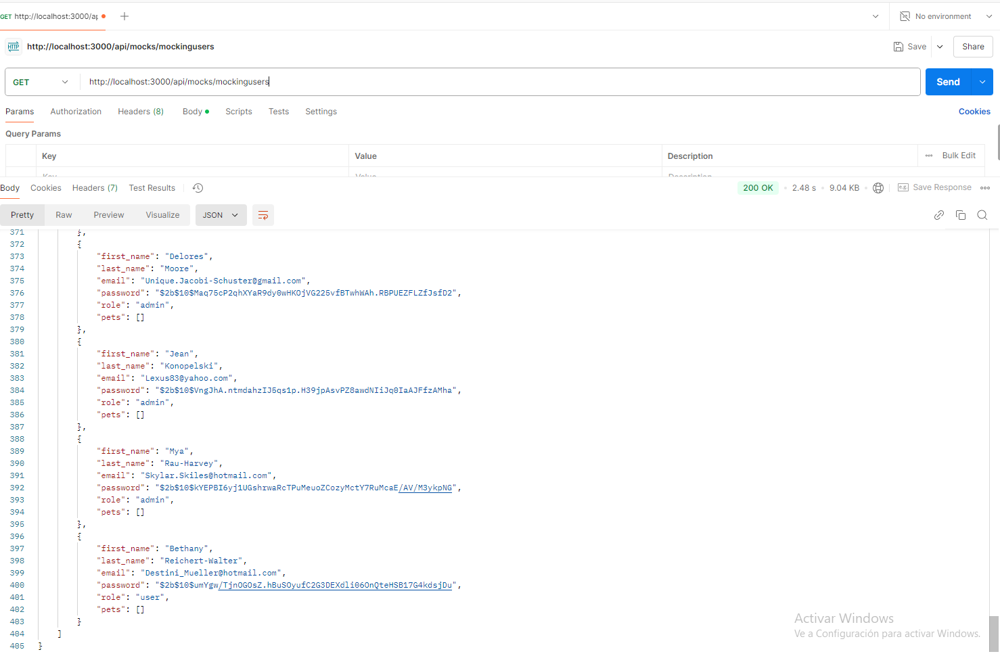
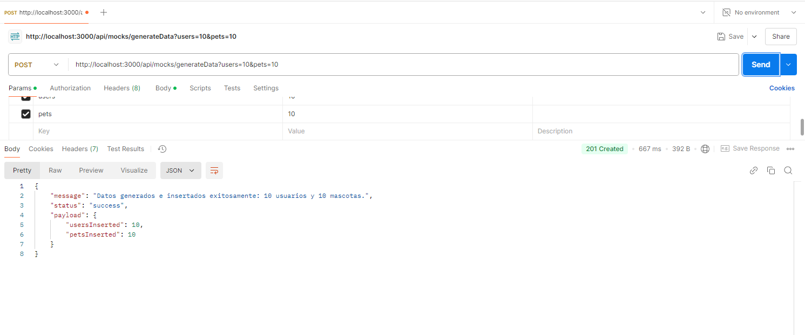
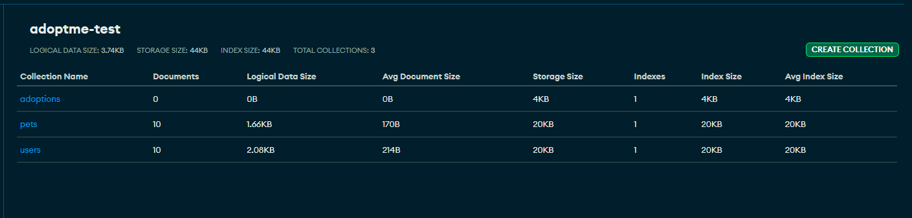

# Backend 3
## Proyecto de generación de mock data para usuarios y mascotas

Este proyecto permite la generación de datos de prueba para colecciones de usuarios y mascotas, utilizando la biblioteca **Faker**. Los datos generados se insertan de forma masiva en la base de datos de pruebas, facilitando la realización de tests con datos ficticios y evitando el uso de datos reales en desarrollo.

## Requisitos Previos

- **Node.js** y **npm** instalados.
- **MongoDB** (URI configurada en un archivo `.env` para la conexión a la base de datos). Ver env.example. 

## Instalación

1. Clonar el repositorio:
   ```bash
   git clone https://github.com/Mica-Grand/backend-3
   cd backend-3
   ``` 
2. Instalar dependencias:
   ```bash
   npm install
   ```
3. Crear archivo `.env` en la raíz del proyecto con la URI de conexión a MongoDB. Ver archivo `env.example`
MONGO_URI=<uri_de_mongodb_para_desarrollo>
MONGO_URI_TEST=<uri_de_mongodb_para_pruebas>
NODE_ENV=test

4. Ejecutar el proyecto:
    ```bash
    node src/app.js
    ```
## Endpoints

### Generación de Datos de Prueba

**GET**

 /api/mocks/mockingpets -
 Genera y devuelve una lista de 50 mascotas ficticias sin insertarlas en la base de datos.

 

/api/mocks/mockingusers  -
Genera y devuelve una lista de 50 usuarios ficticios sin insertarlos en la base de datos.



**POST**
/api/mocks/generateData  - Genera e inserta datos ficticios en la base de datos.
Query Parameters:
users (opcional): Número de usuarios a generar (valor predeterminado: 50).
pets (opcional): Número de mascotas a generar (valor predeterminado: 50).
Ejemplo de URL: `/api/mocks/generateData?users=10&pets=10`





 

